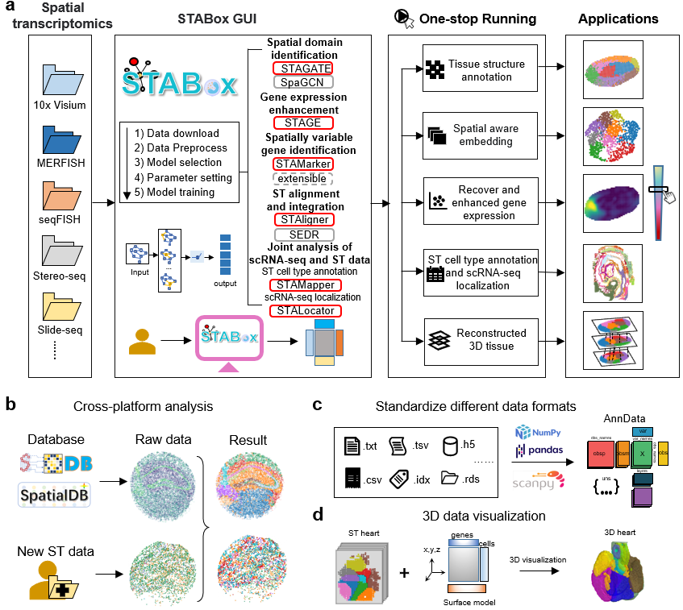

# STABox

STABox is a one-stop platform for spatial transcriptomics data that provide a unified data processing pipeline, versatile data analysis modules, and interactive visualization. It integrates a suite of advanced analysis tools based on graph neural networks. STABox supports interactive 2D/3D visualization of spatial transcriptomics data, simplifying the generation and refinement of publication-ready high-quality images. STABox is extensible, allowing for seamless integration with various analysis methods to facilitate comprehensive downstream analysis of spatial transcriptomics data. 



Folder structure: （请按照最新的文件组织结构更新下面的内容）

```
stabox
├─src
│  └─stabox
│      ├─config
│      ├─dataset
│      ├─extension
│      ├─model
│      ├─preprocessing
│      └─view
└─tests
```
- `config`: save configuration yaml files
- `extension`: save the third-party code, e.g. `SEDR`, `SpaGCN`
- `dataset`: save the code for loading data. All loading functions should return an `AnnData` object with spatial information in `.obsm['spatial']`.
- `model`: save the model code, including `STAgate`, `STAligner` and `STAMarker`. 
All methods should be inherited from `BaseModelMixin` in [`_mixin.py`](./src/stabox/model/_mixin.py).
- `preprocessing`: save the preprocessing code, all preporcessing functions should take `AnnData` as input and return `AnnData` as output.
- `view`: save the visualization code for gui.
-  `pl`: save the code for plotting, ideally all plotting functions should take `AnnData` as input and return plotted figure as output.
-  

## Installation

The STABox package is developed based on the Python libraries [Scanpy](https://scanpy.readthedocs.io/en/stable/), [PyTorch](https://pytorch.org/), [DGL](https://github.com/dmlc/dgl/), and [PyG](https://github.com/pyg-team/pytorch_geometric) (*PyTorch Geometric*) framework, and can be run on GPU (recommend) or CPU.

First clone the repository. 

```
git clone https://github.com/zhanglabtools/STABox.git
cd STABox-main
```

It's recommended to create a separate conda environment for running STABox:

```
#create an environment called env_STABox
conda create -n env_STABox python=3.8

#activate your environment
conda activate env_STABox
```


The use of the mclust algorithm requires **R** environment, the **rpy2** package (Python) and the **mclust** package (R). See https://pypi.org/project/rpy2/ and https://cran.r-project.org/web/packages/mclust/index.html for detail.

Install **R** environment in python by conda:

```
conda install -c conda-forge r-base
```

Other required packages are listed in **STABox_env.yaml**.


##### Run STABox toolkit

```
cd STABox-main\src
python -m stabox.view.app
```

If run successfully, you will launch the following GUI:


https://stabox-tutorial.readthedocs.io/en/latest/


## Support

If you have any questions, please feel free to contact us longquanlu99@163.com. 


## Citation

...

## FAQs

Q: How to install **PyG** from whl files?

A: Please download the whl files from https://pytorch-geometric.com/whl/index.html. Note that the version of python, torch, PyG, and cuda should match. 

